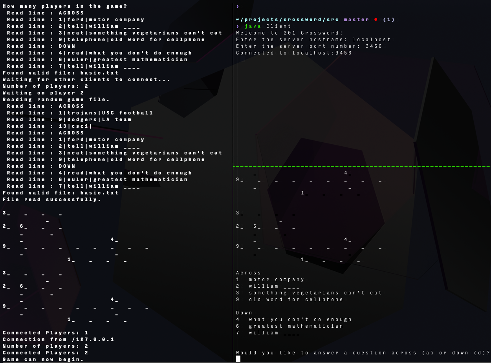

# Crossword Game
Networked crossword game written for **CSCI 201**.

Gameplay is terminal based... sorry! Here's what it should look like:



*USC students: do not copy, you have been warned!* 😼

Operation:
- compile program: `javac *.java`
- run game server: `java Server`
	- note: server hosts the game on port `3456` by default
- run game clients: `java Client`
	- enter hostname: `localhost`
	- enter port number: `3456`
	- reply to server prompts and enjoy the game!

Crossword Format:

```txt
ACROSS
1|trojans|What is USC’s mascot?(trojans)
2|dodgers|What professional baseball team is closest to USC?(dodgers)
3|csci|What is the four-letter prefix for Computer Science?(csci)
DOWN
1|traveler|What is the name of USC’s white horse?(traveler)
4|gold|What is one of USC’s colors?(gold)
5|marshall|Who is USC’s School of Business named after?(marshall)
```

Written with `Vim`


